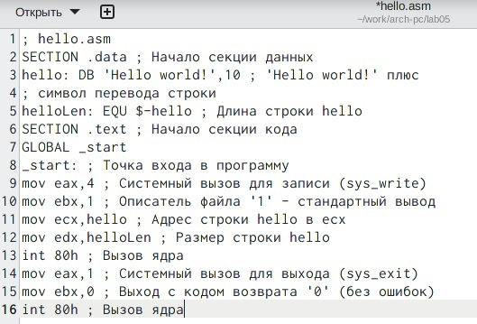
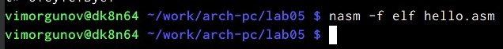
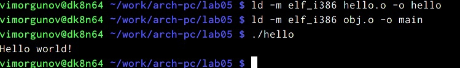
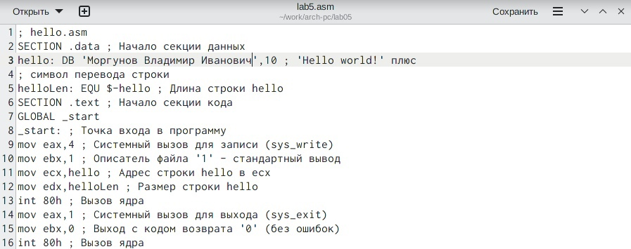
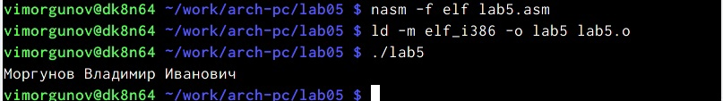

---
## Front matter
title: "Лаборная работа №5 Создание и процесс обработки программ на языке ассемблера NASM "
subtitle: "НММ-бд-02-22"
author: "Моргунов Владимир Иванович"

## Generic otions
lang: ru-RU
toc-title: "Содержание"

## Bibliography
bibliography: bib/cite.bib
csl: pandoc/csl/gost-r-7-0-5-2008-numeric.csl

## Pdf output format
toc: true # Table of contents
toc-depth: 2
lof: true # List of figures
lot: true # List of tables
fontsize: 12pt
linestretch: 1.5
papersize: a4
documentclass: scrreprt
## I18n polyglossia
polyglossia-lang:
  name: russian
  options:
	- spelling=modern
	- babelshorthands=true
polyglossia-otherlangs:
  name: english
## I18n babel
babel-lang: russian
babel-otherlangs: english
## Fonts
mainfont: PT Serif
romanfont: PT Serif
sansfont: PT Sans
monofont: PT Mono
mainfontoptions: Ligatures=TeX
romanfontoptions: Ligatures=TeX
sansfontoptions: Ligatures=TeX,Scale=MatchLowercase
monofontoptions: Scale=MatchLowercase,Scale=0.9
## Biblatex
biblatex: false
biblio-style: "gost-numeric"
biblatexoptions:
  - parentracker=true
  - backend=biber
  - hyperref=auto
  - language=auto
  - autolang=other*
  - citestyle=gost-numeric
## Pandoc-crossref LaTeX customization
figureTitle: "Рис."
lofTitle: "Список иллюстраций"
## Misc options
indent: true
header-includes:
  - \usepackage{indentfirst}
  - \usepackage{float} # keep figures where there are in the text
  - \floatplacement{figure}{H} # keep figures where there are in the text
---
# Цель работы
Познакомиться с ассемблером, научиться компилировать файлы

# Задание

Сделать программу на асеемблере, а также скомпилировать её 

# Выполнение лабораторной работы

1. Используя команду touch создадим файл hello.asm и с помощью текстового редактора впишем в него программу

{ #fig:001 width=70% }

2. Командой nasm -f elf hello.asm переделаем текст в объектный код 

{ #fig:002 width=70% }

3. Создадим файл obj.o, далее саздадим файл main из файла obj.o и запустим файл hello

{ #fig:003 width=70% }

# Выполнение самостоятельной работы 

1. Скопируем файл hello.asm и переименнуем с помощью команды cp

{ #fig:004 width=70% }

2. Поменяем выводящийся текст 

{ #fig:005 width=70% }

3. Создадим объектный файл, затем исполняемый, после запустим его

{ #fig:006 width=70% }

4. Отправим файлы на github

# Вывод

Я научился работать с созданием простейших команд на языке ассемблера NASM, а также создавать объектный и исполняемый файл.

